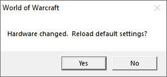

# WoW Vanilla Regfix

Fixes the "Hardware changed. Reload default settings?" message box that appears when
switching between World of Warcraft 1.x and newer clients.

The issue is that all clients share the same registry subkey

	HKEY_CURRENT_USER\SOFTWARE\Blizzard Entertainment\World of Warcraft\Client

but the WoW Vanilla client handles values stored there for HWCpuIdx and HWVideoID differently.
So these hardware identifiers keep changing, which causes the game to assume that the
hardware must be different and display the aforementioned message box.

This fix intercepts calls to RegOpenKeyExW and RegCreateKeyExW and rewrites the destination
where necessary. This means the WoW Vanilla client now uses the following separate registry subkey:

	HKEY_CURRENT_USER\SOFTWARE\Blizzard Entertainment\World of Warcraft Vanilla\Client

## How to Use

There is currently no launcher for injecting the DLL included. I recommend using
[VanillaFixes](https://github.com/hannesmann/vanillafixes) which can load additional
DLLs (and really helps with framerate issues on the old client).

- Install [VanillaFixes](https://github.com/hannesmann/vanillafixes).
- Grab regfix.dll from the releases section and copy it to the WoW root directory.
- Open dlls.txt in the WoW root directory and add a new line "regfix.dll" at the end.
- Run game using the VanillaFixes.exe launcher.

## Build

Building requires Visual Studio and GNU Make for Window (which can be found in tools/).
Make should be in your system path. From the project directory run:

	make

This builds the binaries with MSBuild and places the DLL in the bin/ directory.
To clean all auxiliary build files run:

	make clean

The build system may be a bit unconventional but I like to use my Linux tools
even when working on Windows systems. GNU Make as a thin wrapper around
MSBuild allows me to have my familiar terminal workflow while compiling
natively with the Visual Studio compiler.

## Licenses

Licenses for this project and MinHook can be found in docs/LICENSE.txt
